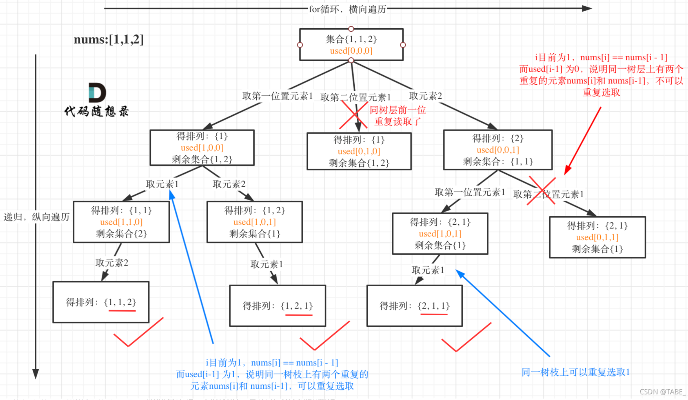

这个模块是一个小进阶的模块，涉及到了很多的递归，由于递归的思想和我们大脑的思考方法是相反的，但是回溯并不是一个很高效的算法，只适合解决一些数据规模比较小的场景。

核心思想是枚举。

回溯模板和递归差不多相同，但是大部分的回溯需要记录路径。因此需要一个 path 参数

一般情况下，可以从三个方面考虑

1. 确定递归参数
2. 确定递归出口
3. 确定递归方向

一般情况下回溯是指数级别的复杂度 

举个例子，为什么不能用 for 循环来解决一些题目，因为如果是循环的话，必须要确定的一点是循环次数，但是如果是求一个数组内`任意两个数字`的排列组合情况，是可以很轻松的解决的。

但是如果是求一个集合的所有子集呢？ 难道你需要把从 1-n 的所有情况都写一个循环，这个时候循环的次数是无法确定的，所以我们只能用`回溯的方法` .

需要画递归树， 每个元素往后选， 就可以得到

这样我们就拿到了所有的子集了，我们可以用列表来存储可以拿到的结果，
然后为了控制顺序，我们需要一个 index，当 index >= length 的时候就可以停下来了。

总结一下 :
1 递归的参数: path
2 递归的出口: index >= length 
3 递归的方向： 【index, length - 1】
