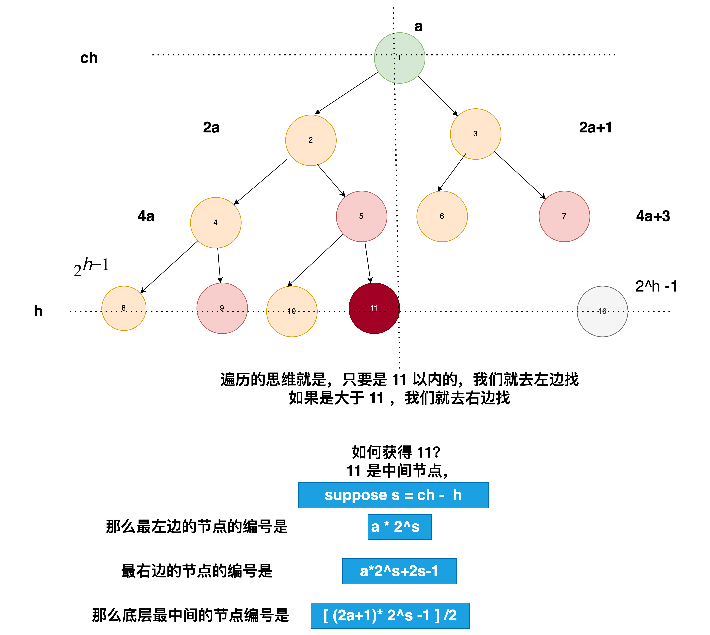

[222. Count Complete Tree Nodes](https://leetcode.com/problems/count-complete-tree-nodes/)

Given the `root` of a **complete** binary tree, return the number of the nodes in the tree.

According to **[Wikipedia](http://en.wikipedia.org/wiki/Binary_tree#Types_of_binary_trees)**, every level, except possibly the last, is completely filled in a complete binary tree, and all nodes in the last level are as far left as possible. It can have between `1` and `2h` nodes inclusive at the last level `h`.

Design an algorithm that runs in less than `O(n)` time complexity.

 

**Example 1:**


```
Input: root = [1,2,3,4,5,6]
Output: 6
```

**Example 2:**

```
Input: root = []
Output: 0
```

**Example 3:**

```
Input: root = [1]
Output: 1
```

 

**Constraints:**

- The number of nodes in the tree is in the range `[0, 5 * 104]`.
- `0 <= Node.val <= 5 * 104`
- The tree is guaranteed to be **complete**.

**solution**

这道题我们当然有很暴力的解法，就是全部遍历一遍，然后节点累加返回。
不管它是什么树。
最简单的代码，假设用递归来写。

```java
class Solution {
    public int countNodes(TreeNode root) {
        if(root == null) return 0;
        return countNodes(root.left) + countNodes(root.right)+1;
    }
}
```

```java 
class Solution {
    public int countNodes(TreeNode root) {
       Deque<TreeNode> q  = new LinkedList();
       if(root!=null) q.offer(root);
       int count = 0; 
       while(!q.isEmpty()){
         int size = q.size();
          count +=size;
         for(int i=0 ; i<size; i++){
            TreeNode node = q.poll();
            if(node.left!=null) q.offer(node.left);
            if(node.right!=null) q.offer(node.right);
         }  
       }
       return count; 
    }
}
```

当然这样面试官肯定是不满意的，因为你没有用用到完全二叉树的特性来解题。

因为是完全二叉树，我们知道前面的层都是满的，最后一层的`最后一个节点的编号就是二叉树的最大深度`

因此我们要找到最后一层的最后一个节点。由于二叉树肯定满足左边满，右节点为空的性质。因此具有二分性，我们可以利用这个性质来求解。

我们假设层高为 h，那么最后一层最左边的节点编号肯定是\(2^{h-1}\),最后一层最右边的节点肯定是$2^h-1$.

所以对于任意一个节点啊,我们获得它当前的编号，然后判断是否等于我们要找的目标编号，如果小于就去左边找，否则就去右边找。



```java
class Solution {
    int depth;

    public int countNodes(TreeNode root) {
        depth = getDepth(root);
        int l = (int) Math.pow(2, depth - 1);
        int r = (int) Math.pow(2, depth) - 1;
        while (l < r) {
            int mid = (l + r + 1) >> 1;
            if (check(root, 1, mid, 1)) {
                l = mid;
            } else {
                r = mid - 1;
            }
        }
        return r;
    }

    boolean check(TreeNode node, int cur_index, int target_index, int cur_depth) {
        if (node == null)
            return false;
        if (cur_index == target_index)
            return true;
        int separate = ((int) Math.pow(2, depth - cur_depth) * (2 * cur_index + 1) - 1) / 2;
        if (target_index <= separate)
            return check(node.left, cur_index * 2, target_index, cur_depth + 1);
        return check(node.right, cur_index * 2 + 1, target_index, cur_depth + 1);
    }

    int getDepth(TreeNode root) {
        if (root == null)
            return 0;
        return Math.max(getDepth(root.left), getDepth(root.right)) + 1;
    }
}
```

首先通过 `getDepth 方法`获取树的深度。然后定义二分查找的边界：左边界 l 是最后一层的可能的最小节点编号，右边界 r 是最后一层的可能的最大节点编号（基于满二叉树的节点计算方式）。

通过`二分查找的方法`来确定实际的最后一个节点的索引。在每一步中，计算中间索引 mid，并通过辅助方法 check 判断这个索引是否代表一个存在的节点。如果存在，说明节点数至少达到了 mid，则移动左边界；如果不存在，移动右边界。这个过程将继续直到左右边界相遇，此时 r 就是完全二叉树的节点总数。


`check 方法`的原理是递归地检查完全二叉树中指定位置的节点是否存在。该方法的参数包括：

node：当前要检查的节点。
cur_index：当前节点在完全二叉树中的索引。
target_index：要检查的目标节点的索引。
cur_depth：当前节点的深度。

这是一个递归方法，用于检查给定的索引 target_index 是否对应一个实际存在的节点。它从根节点开始（初始时 cur_index 为 1，即根节点的索引），每次递归时根据当前节点的索引决定进入左子树还是右子树，并更新当前索引。

计算分割索引 separate：它是当前节点左子树中最右边节点的索引。
如果 target_index 小于等于 separate，则目标节点可能在左子树中，递归进入左子节点；
否则递归进入右子节点。

在开始时，如果你正在查找比当前已知最右节点还要右的位置，就会持续深入右子树。

随着二分查找进程的推进，当 mid 足够小以至于可以在树的左半部分找到时，查找过程将会开始进入左子树。

如果遇到空节点（node == null），说明路径上的某个点不存在对应的子节点，返回 false。如果 cur_index 等于 target_index，说明找到了目标节点，返回 true。

这样的逻辑确保了，即使在最初 target_index 的值比较大，递归的过程也会逐步深入到二叉树的合适深度和位置，精确地找到或者验证目标节点是否存在。此外，二分查找的逻辑确保了我们不会浪费时间在不存在的节点上，每次都是在缩小可能存在节点的范围，直到最终确定树中实际存在的节点数量。这种方法相比传统的逐个检查每个节点的方法在大型数据集上要高效得多。


