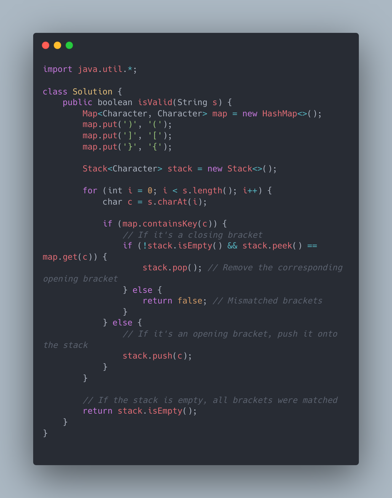

[20. Valid Parentheses](https://leetcode.com/problems/valid-parentheses/)

Given a string `s` containing just the characters `'('`, `')'`, `'{'`, `'}'`, `'['` and `']'`, determine if the input string is valid.

An input string is valid if:

1. Open brackets must be closed by the same type of brackets.
2. Open brackets must be closed in the correct order.
3. Every close bracket has a corresponding open bracket of the same type.

 

**Example 1:**

```
Input: s = "()"
Output: true
```

**Example 2:**

```
Input: s = "()[]{}"
Output: true
```

**Example 3:**

```
Input: s = "(]"
Output: false
```

 

**Constraints:**

- `1 <= s.length <= 104`
- `s` consists of parentheses only `'()[]{}'`.

**solitons**

使用 hash map 做一个括号关系的映射。

我们先用 map 把匹配的括号类型以 key 和 value 的形式存入 
通过栈的性质来进行判断 
如果是左括号就进入栈
如果是右括号就和栈去匹配
我们遍历 s 字符串 
不难发现，如果是正确的顺序，遍历到右括号的时候栈顶肯定是离 ta 最近的一个左括号

注意栈为空的情况 

**Code**

