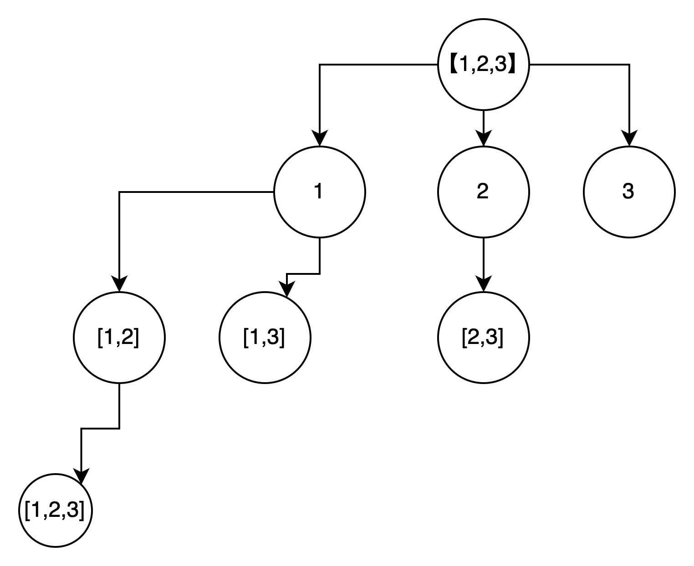

## [👋Guide for Data Structures and Algorithms](https://carolzhangzz.github.io/DataStructure_Algorithm_HandBook_PreForLeetCode/)
 
 ## [Switch To： Reading Mode📚](https://carolzhangzz.github.io/DataStructure_Algorithm_HandBook_PreForLeetCode/) 

`This HandBook it currently developed by gitHub page.`

## Basic Language Features

[右移和左移操作](./javaBasic.md)
[js 语法](./jsBasic.md)

## Basic Data Structure

### LinkedList

[206. Reverse Linked List](./Linkedlist/206.md)

[92. Reverse Linked List II](./Linkedlist/92.md)

[83. Remove Duplicates from Sorted List](./Linkedlist/83.md)

[19. Remove Nth Node From End of List](./Linkedlist/19.md)

[21. Merge Two Sorted Lists](./Linkedlist/21.md)

[160. Intersection of Two Linked Lists](./Linkedlist/160.md)

[2. Add Two Numbers](./Linkedlist/2.md)

[142. Linked List Cycle II](./Linkedlist/142.md)

### Hash Map

[1160. Find Words That Can Be Formed by Characters](./HashTable/1160.md)

[1189. Maximum Number of Balloons](./HashTable/1189.md)

[1207. Unique Number of Occurrences](./HashTable/1207.md)

[217. Contains Duplicate](./HashTable/217.md)

[20. Valid Parentheses](./HashTable/20.md)

### Search Algorithm

[DFS（深度优先搜索)](./SearchAlgorithm/DFS.md)

[BFS（广度优先搜索）](./SearchAlgorithm/BFS.md)

### Binary tree

A binary tree is a simple directed graph where each node has a left node and a right node.

The main traversal methods of binary trees are BFS and DFS.

[226. Invert Binary Tree](./BinaryTree/226.md)

[101. Symmetric Tree](./BinaryTree/101.md)

[104. Maximum Depth of Binary Tree](./BinaryTree/104.md)

[111. Minimum Depth of Binary Tree](./BinaryTree/111.md)

[222. Count Complete Tree Nodes](/BinaryTree/222.md)

[110. Balanced Binary Tree](/BinaryTree/110.md)

[257. Binary Tree Paths](./BinaryTree/275.md)

[404. Sum of Left Leaves](./BinaryTree/404.md)
 
[513. Find Bottom Left Tree Value](./BinaryTree/513.md)

[112. Path Sum](./BinaryTree/112.md) 

[654. Maximum Binary Tree](./BinaryTree/654.md)

[617. Merge Two Binary Trees](./BinaryTree/617.md)

[235. Lowest Common Ancestor of a Binary Search Tree](./BinaryTree/235.md)

[108. Convert Sorted Array to Binary Search Tree](./BinaryTree/108.md)

### Backtracking algorithm

这个模块是一个小进阶的模块，涉及到了很多的递归，由于递归的思想和我们大脑的思考方法是相反的，但是回溯并不是一个很高效的算法，只适合解决一些数据规模比较小的场景。

核心思想是枚举。

回溯模板和递归差不多相同，但是大部分的回溯需要记录路径。因此需要一个 path 参数

一般情况下，可以从三个方面考虑

1. 确定递归参数
2. 确定递归出口
3. 确定递归方向

一般情况下回溯是指数级别的复杂度 

举个例子，为什么不能用 for 循环来解决一些题目，因为如果是循环的话，必须要确定的一点是循环次数，但是如果是求一个数组内`任意两个数字`的排列组合情况，是可以很轻松的解决的。

但是如果是求一个集合的所有子集呢？ 难道你需要把从 1-n 的所有情况都写一个循环，这个时候循环的次数是无法确定的，所以我们只能用`回溯的方法` .

需要画递归树， 每个元素往后选， 就可以得到

这样我们就拿到了所有的子集了，我们可以用列表来存储可以拿到的结果，
然后为了控制顺序，我们需要一个 index，当 index >= length 的时候就可以停下来了。

总结一下 :
1 递归的参数: path
2 递归的出口: index >= length 
3 递归的方向： 【index, length - 1】

[77. Combinations](./Backtracking/77.md)

[39. Combination Sum](./Backtracking/39.md)

 

#### Basic Intro

Data structures and algorithms are essential topics in computer science.

whether you are looking to enter the software development industry⛽️, enhance your career skills, or prepare for interviews🚀.

I am trying to list all the sections💪, and hope this guide will serve as a good starting point.

### `Tips for beginners:`

#### Do not stay too long in one question ⏰. 

When you are stuck, try to think for 7~10 minutes. If you still could not figure it out or have any ideas, you should see the answers.

#### Use tools to help you understand 📱. 

Data structures can sometimes be difficult to grasp because it's hard to think through them using only your brain. Try drawing graphs and breaking down the steps.

#### Be patient and not limited to one solution 🤔. 

Most questions should have various answers. Try to explore multiple solutions if you can. Sometimes, other answers will give you more insight. Remember, it's not about how many questions you've done; it's about whether you're familiar with the algorithms behind them.

#### Discuss code with others 👭👬. 

Whether they fully understand it or not, discussing code with others can enhance your grasp of programming languages.
